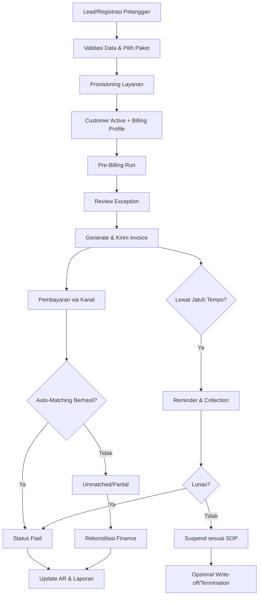

# Workflow Profesional Sistem ISP Billing

## 1. Tujuan
Membangun proses billing ISP yang akurat, terukur, dan mudah diaudit, dari registrasi pelanggan sampai pelunasan dan penanganan tunggakan.

## 2. Prinsip Utama
- Accuracy: Tidak ada selisih tarif, pajak, atau periode tagihan.
- Automation first: Semua proses berulang dijalankan terjadwal.
- Auditability: Semua perubahan data tercatat di log.
- Revenue assurance: Kebocoran pendapatan diminimalkan.
- Customer experience: Tagihan jelas, pengingat tepat waktu, kanal pembayaran beragam.

## 3. Aktor dan Tanggung Jawab
- Sales/CS: Registrasi pelanggan, validasi dokumen, aktivasi layanan.
- NOC/Provisioning: Aktivasi teknis layanan internet.
- Finance/Billing: Generate invoice, rekonsiliasi pembayaran, denda, penutupan buku.
- Collection: Follow-up tunggakan dan negosiasi pembayaran.
- System Admin/IT: Integrasi payment gateway, scheduler, monitoring, backup.

## 4. Master Data yang Wajib Siap
- Data pelanggan: Identitas, alamat, kontak, segmentasi (residential/corporate).
- Data layanan: Paket internet, add-on (IP statik, CPE rental, dll), masa kontrak.
- Data tarif: Harga paket, PPN, biaya instalasi, deposit, denda keterlambatan.
- Data siklus billing: Tanggal cut-off, tanggal cetak invoice, tanggal jatuh tempo.
- Data pembayaran: Virtual account, e-wallet, transfer bank, auto-debit.

## 5. Workflow End-to-End

### 5.1 Onboarding Pelanggan
1. Sales/CS membuat prospek dan input data calon pelanggan.
2. Sistem melakukan validasi duplikasi (NIK, email, nomor HP, alamat).
3. Pilih paket layanan dan term kontrak.
4. Jika perlu, generate biaya instalasi/deposit.
5. NOC melakukan provisioning jaringan.
6. Status pelanggan berubah menjadi Active setelah aktivasi berhasil.

Output:
- Customer ID unik
- Service ID unik
- Billing profile aktif

### 5.2 Konfigurasi Billing Profile
1. Tentukan siklus billing pelanggan (misal: tanggal 1-akhir bulan).
2. Tentukan pro-rata untuk pelanggan baru di tengah bulan.
3. Tetapkan metode pembayaran default.
4. Simpan rule denda keterlambatan dan grace period.

Output:
- Billing rule pelanggan tervalidasi

### 5.3 Billing Run (Bulanan)
1. Scheduler menjalankan proses pre-billing pada H-3.
2. Sistem menghitung komponen tagihan:
   - Recurring charge (paket bulanan)
   - One-time charge (instalasi, upgrade, penalti)
   - Add-on charge
   - Diskon/promosi
   - Pajak
3. Finance melakukan review exception report:
   - Tarif 0
   - Duplikasi charge
   - Akun suspend tapi tetap ditagih penuh
4. Jika valid, sistem generate invoice final pada tanggal cetak.
5. Invoice dikirim otomatis via email, WhatsApp, dan portal pelanggan.

Output:
- Invoice terbit dengan nomor unik dan status Unpaid

### 5.4 Payment Collection
1. Pelanggan membayar melalui kanal yang tersedia.
2. Payment gateway/bank mengirim callback ke sistem.
3. Sistem melakukan auto-matching berdasarkan:
   - Nomor invoice
   - Customer ID/VA
   - Nominal pembayaran
4. Jika cocok penuh, status invoice menjadi Paid.
5. Jika kurang bayar, status Partial dan sisa otomatis tercatat.
6. Finance menangani unmatched payment melalui menu rekonsiliasi.

Output:
- AR (Account Receivable) terupdate real-time

### 5.5 Reminder dan Collection Tunggakan
1. H-3 jatuh tempo: reminder pertama.
2. Hari H jatuh tempo: reminder kedua.
3. H+3: status Overdue + notifikasi collection.
4. H+7: optional suspend parsial (walled garden).
5. H+14: suspend penuh (sesuai kebijakan).
6. Setelah lunas, sistem auto-unsuspend (atau by approval jika manual).

Output:
- Aging piutang terkontrol
- SOP penagihan konsisten

### 5.6 Dispute, Adjustment, dan Credit Note
1. Pelanggan komplain tagihan melalui tiket.
2. Billing analyst investigasi log penggunaan, paket, dan histori perubahan.
3. Jika valid, lakukan adjustment:
   - Credit note
   - Debit note
   - Waive denda (by approval matrix)
4. Semua adjustment wajib menyimpan alasan dan approver.

Output:
- Koreksi tagihan terdokumentasi dan auditable

### 5.7 Month-End Closing
1. Rekonsiliasi total invoice vs total penerimaan.
2. Cek unmatched payment dan posting jurnal.
3. Generate laporan:
   - MRR (Monthly Recurring Revenue)
   - AR aging
   - Collection rate
   - Churn karena suspend/non-payment
4. Kunci periode billing untuk mencegah perubahan backdate tanpa otorisasi.

Output:
- Laporan keuangan billing siap audit

## 6. Status Lifecycle (Disarankan)
- Customer: Prospect -> Pending Activation -> Active -> Suspended -> Terminated
- Invoice: Draft -> Posted -> Unpaid -> Partial -> Paid -> Overdue -> Written Off
- Ticket: Open -> In Review -> Approved/Rejected -> Closed

## 7. Kontrol Internal (Wajib)
- Role-based access control (RBAC) untuk fungsi sensitif.
- Maker-checker approval untuk diskon khusus, waive denda, dan write-off.
- Audit trail immutable untuk perubahan tarif, invoice, dan pembayaran.
- Daily backup + restore test berkala.
- Monitoring job scheduler dan notifikasi gagal proses.

## 8. SLA Operasional (Contoh)
- Callback pembayaran masuk ke sistem: < 1 menit
- Rekonsiliasi unmatched payment: < 1 hari kerja
- Waktu terbit invoice setelah billing run: < 30 menit
- Respon dispute billing: < 2 hari kerja

## 9. KPI yang Harus Dipantau
- Billing accuracy rate
- Collection rate (D30, D60, D90)
- Days Sales Outstanding (DSO)
- Persentase unmatched payment
- Jumlah invoice dispute per 1.000 pelanggan
- Suspend-to-reactivate conversion rate

## 10. Diagram Workflow (Mermaid)

## 11. Rekomendasi Implementasi Teknis Singkat
- Gunakan job scheduler terpisah untuk:
  - pre-billing
  - invoice generation
  - reminder
  - suspension/unsuspension
  - rekonsiliasi harian
- Pastikan idempotency pada callback pembayaran agar tidak double posting.
- Gunakan event log untuk setiap perubahan status invoice/customer.
- Siapkan dashboard real-time untuk Finance, Collection, dan NOC.

## 12. Checklist Go-Live
- Semua master data tarif dan pajak tervalidasi.
- UAT skenario normal, partial payment, gagal callback, dan dispute selesai.
- SOP collection dan approval matrix disetujui manajemen.
- Integrasi payment channel lolos uji end-to-end.
- Simulasi billing run minimal 2 siklus.
